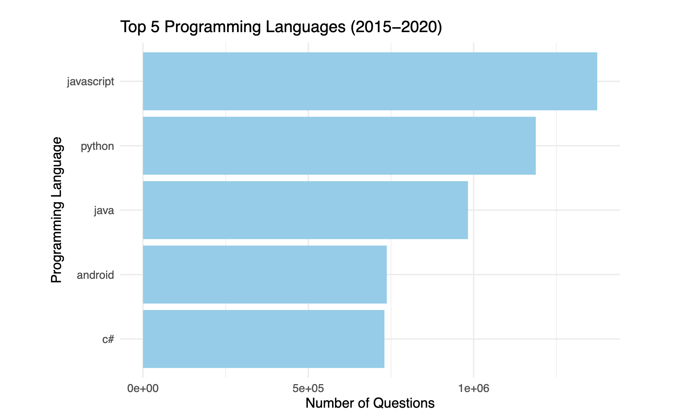

# Programming Language Trends Analysis

By James Weaver

Project: Stack Overflow Data (2008–2020)

# Introduction
This project investigates trends in programming language popularity by analyzing Stack Overflow's dataset which spans over a decade of user-generated questions. Using R programming, the analysis identifies the relative growth and decline of languages such as Python, R, Java, and JavaScript. This work aims to provide insights into the evolution of programming technologies, helping professionals decide where to focus their learning and development efforts.

# Files
The core analysis is contained within several files that showcase data transformations, visualizations, and insights:
programming_trends_analysis.Rmd: This R Notebook serves as the main document for the project, containing detailed steps for loading, processing, and analyzing the dataset. It highlights trends, calculates growth rates, and visualizes language-specific insights.
top_languages_2015_2020.pdf: A concise report summarizing the top five programming languages with the highest question counts between 2015 and 2020.
stack_overflow_data.csv: The dataset used, consisting of question tags, total questions per year, and other metrics, sourced from Stack Exchange Data Explorer.
README.md: A comprehensive guide to the project, outlining its purpose, methodology, and findings.

# Analysis
- Processed a dataset spanning 2008–2020 to compute the percentage of annual questions tagged with each programming language.
- Identified the five programming languages with the highest cumulative question counts between 2015 and 2020.
- Visualized trends in language popularity over time using R's ggplot2 library.
- Python emerged as the fastest-growing language, while others like R showed steady growth.

# Key Insights
- Python's popularity has surged, consistently growing over the years, reflecting its adoption in machine learning, data science, and web development.
- JavaScript continues to dominate as a versatile, stable language for front-end and back-end development.
- Traditional languages like Java show a slight decline, indicating a potential shift towards more modern and dynamic alternatives.
- Languages like R retain relevance in data science but are passed by Python in general purpose and applied use cases.

# Visuals

